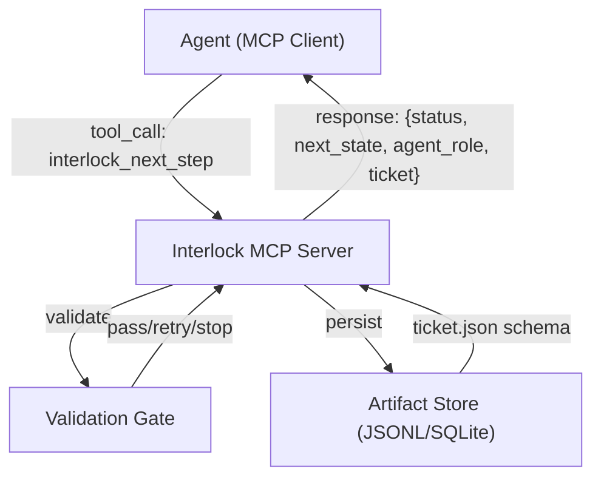

# Interlock PoC Planning Document

## Purpose

This document outlines a step-by-step plan to build a **Proof of Concept (PoC)** for Interlock that demonstrates how an MCP server governs an agent through structured tool calls and responses. The PoC will showcase:

1. **Agent governance**: MCP tool calls that tell the agent whether to continue, what the next step is, and what the agent's role is
2. **Strict schema validation**: All artifacts (especially `ticket.json`) must conform to Pydantic schemas
3. **Deterministic FSM**: State transitions are controlled by Interlock, not the agent
4. **Validation gates**: Each step has clear pass/retry/stop criteria

## Core Architecture (PoC Scope)



## Step-by-Step Implementation Plan

### Step 1: MCP Server Skeleton with Demo Tool

**Goal**: Establish basic MCP server infrastructure with a single demo tool that the agent can call.

**Tasks**:

- Set up Python project structure (`interlock/` package)
- Install dependencies: `mcp`, `pydantic>=2.0`, `asyncio`
- Create `interlock/server.py` with minimal MCP server implementation
- Implement one demo tool: `interlock_next_step` that returns a hardcoded response
- Add basic error handling and logging

**Validation Criteria**:

- [ ] MCP server starts and accepts connections

- [ ] Agent can call `interlock_next_step` tool
- [ ] Tool returns a structured JSON response
- [ ] Server logs tool calls and responses

**Deliverable**: Working MCP server that responds to `interlock_next_step` with a mock response.

---

### Step 2: Define Pydantic Ticket Schema

**Goal**: Create strict Pydantic schema for `ticket.json` that enforces structure and validation.

**Tasks**:

- Create `interlock/schemas/` directory
- Define `interlock/schemas/ticket.py` with `Ticket` Pydantic model:
  - `ticket_id: str`
  - `title: str`
  - `description: str | None`
  - `state: Literal["intake", "extract_requirements", "scope_context", "gather_evidence", "propose_plan", "act", "finalize"]`
  - `run_id: str`
  - `created_at: datetime`
  - `updated_at: datetime`
- Add validation rules (e.g., `ticket_id` must be non-empty, `state` must be valid FSM state)
- Create `interlock/schemas/__init__.py` to export schemas

**Validation Criteria**:

- [ ] `Ticket` model can be instantiated with valid data
- [ ] `Ticket` model raises `ValidationError` for invalid data
- [ ] Schema can serialize to/from JSON
- [ ] Schema validates required fields and types

**Deliverable**: `Ticket` Pydantic model with validation rules.

---

### Step 3: Implement FSM State Enum and Transition Logic

**Goal**: Define the 7-step FSM lifecycle and centralize transition authority.

**Tasks**:

- Create `interlock/fsm.py` with:
  - `State` enum (7 states from Overview.md)
  - `TransitionResult` Pydantic model: `{status: Literal["pass", "retry", "stop"], reason: str, next_state: State | None, agent_role: str}`
  - `transition()` function that takes current state and returns `TransitionResult`
  - State transition map (which states can transition to which)
- Implement basic transition logic (for PoC: allow transitions in order)
- Add logging for all transitions

**Validation Criteria**:

- [ ] `State` enum contains all 7 states
- [ ] `transition()` returns valid `TransitionResult` for each state
- [ ] Invalid transitions are rejected
- [ ] Transitions are logged with reasons

**Deliverable**: FSM module with state enum and transition function.

---

### Step 4: Implement Validation Gate Structure

**Goal**: Create gate framework that validates artifacts and returns structured pass/retry/stop results.

**Tasks**:

- Create `interlock/gates.py` with:
  - `GateResult` Pydantic model: `{status: Literal["pass", "retry", "stop"], reasons: list[str], fixes: list[str] | None}`
  - `Gate` base class or protocol
  - At least one concrete gate: `IntakeGate` that validates ticket references
- Implement gate logic that checks ticket schema compliance
- Return structured `GateResult` with actionable feedback

**Validation Criteria**:

- [ ] Gate returns `GateResult` with correct structure
- [ ] Gate validates ticket schema (Pydantic validation)
- [ ] Gate returns "pass" for valid tickets
- [ ] Gate returns "retry" or "stop" with reasons for invalid tickets
- [ ] Gate results are logged

**Deliverable**: Gate framework with at least one working gate.

---

### Step 5: Integrate Ticket Schema with MCP Tool

**Goal**: Make `interlock_next_step` tool accept and validate `ticket.json` input, then return governance response.

**Tasks**:

- Update `interlock_next_step` tool to:
  - Accept `ticket_json: str` parameter (JSON string)
  - Parse and validate against `Ticket` Pydantic schema
  - Call appropriate gate based on current ticket state
  - Determine next state using FSM transition logic
  - Return response: `{status, next_state, agent_role, ticket, gate_result}`
- Handle validation errors gracefully (return "retry" with fix suggestions)
- Add logging for tool invocations

**Validation Criteria**:

- [ ] Tool accepts valid `ticket.json` and validates it
- [ ] Tool rejects invalid `ticket.json` with clear error messages
- [ ] Tool returns governance response with `status`, `next_state`, `agent_role`
- [ ] Tool calls gate and includes gate result in response
- [ ] Invalid tickets trigger "retry" or "stop" responses

**Deliverable**: MCP tool that validates tickets and returns governance instructions.

---

### Step 6: Implement Artifact Persistence

**Goal**: Store ticket artifacts and run events for traceability.

**Tasks**:

- Create `interlock/storage.py` with:
  - `ArtifactStore` class (use JSONL or SQLite for PoC)
  - `save_ticket(ticket: Ticket)` method
  - `save_event(run_id: str, event: dict)` method
  - `get_ticket(ticket_id: str) -> Ticket | None` method
- Integrate storage into MCP tool (save ticket after validation)
- Store gate results as events
- Add run_id tracking

**Validation Criteria**:

- [ ] Tickets are persisted after tool calls
- [ ] Events are logged with run_id, timestamp, state
- [ ] Stored tickets can be retrieved
- [ ] Storage handles concurrent access (if applicable)

**Deliverable**: Artifact storage that persists tickets and events.

---

### Step 7: End-to-End Demo Flow

**Goal**: Demonstrate complete agent governance flow through at least 2 FSM states.

**Tasks**:

- Create demo script or test that:
  - Agent calls `interlock_next_step` with ticket in "intake" state
  - Interlock validates, transitions to "extract_requirements"
  - Agent calls again with updated ticket in "extract_requirements" state
  - Interlock validates, transitions to "scope_context"
- Verify governance responses guide agent correctly
- Verify ticket schema is maintained throughout
- Generate trace/log showing state transitions

**Validation Criteria**:

- [ ] Agent receives clear "pass" response with next state
- [ ] Agent receives "agent_role" instructions for next step
- [ ] Ticket state progresses through FSM correctly
- [ ] Invalid tickets trigger appropriate "retry" or "stop" responses
- [ ] All artifacts are persisted and traceable

**Deliverable**: Working demo showing agent governance through 2+ FSM states.

---

## PoC Success Criteria

The PoC is successful when:

1. ✅ Agent can call `interlock_next_step` MCP tool
2. ✅ Tool validates `ticket.json` against strict Pydantic schema
3. ✅ Tool returns governance response: `{status, next_state, agent_role}`
4. ✅ FSM enforces state transitions (agent cannot skip states)
5. ✅ Gates validate artifacts and return structured pass/retry/stop results
6. ✅ At least 2 state transitions work end-to-end
7. ✅ All artifacts are persisted and traceable

## File Structure (PoC)

```
interlock/
├── __init__.py
├── server.py          # MCP server entry point
├── fsm.py            # FSM state enum and transitions
├── gates.py           # Validation gates
├── storage.py         # Artifact persistence
└── schemas/
    ├── __init__.py
    ├── ticket.py      # Ticket Pydantic model
    └── responses.py   # Response models (GateResult, TransitionResult)
```

## Next Steps After PoC

Once the PoC validates the core governance mechanism:

1. Implement remaining 5 FSM states
2. Add more sophisticated gates (requirements validation, evidence traceability)
3. Integrate with real Jira/GitHub MCP servers
4. Add retry logic with bounded attempts
5. Implement checkpointing for rollback
6. Add comprehensive logging and observability

## Notes

- **Thin-slice focus**: Each step should be independently validatable
- **Fail closed**: Gates must return structured results, never silent failures
- **Evidence-first**: Even in PoC, maintain traceability (store ticket + events)
- **No secrets**: Never log/commit tokens or API keys