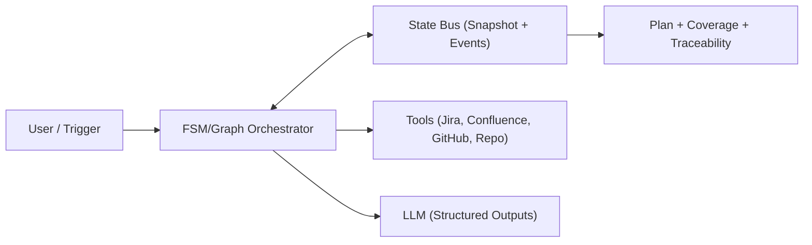

# Interlock
[](LICENSE)
[](#)

**Interlock** turns Jira ticket resolution into an **agentic context compiler** controlled by a **deterministic FSM/graph** and powered by a **structured State Bus**.

Instead of pushing raw dumps of Jira tickets and Confluence pages into a large language model, Interlock compiles the context into a **validated snapshot**: requirements are pinned early, evidence is indexed, claims are grounded, and the final output is a plan that is strictly traceable back to its sources.

---

## **Motivation**

AI workflows for complex tickets often suffer from:
1.  **The Context Tax**: Passing huge raw documents increases costs and latency while reducing accuracy.
2.  **Compounding Hallucinations**: Early mistakes in file paths or assumptions cascade into the final output.
3.  **Non-Deterministic Behavior**: Agents that "improvise" tool use often loop or fail unpredictably.
4.  **Memory Drift**: Requirements get diluted or forgotten as more context is gathered.

Interlock solves this by enforcing **evidence-first reasoning** and **pinned requirements**.

---

## **Core Principles**

-   **Determinism over Improvisation**: A Finite State Machine (FSM) decides the next step, not the LLM. The model proposes structured data; the orchestrator handles routing.
-   **Evidence-First**: The unit of reasoning is an **evidence object** (snippet + locator + provenance), not a full document.
-   **Pinned Requirements**: Acceptance criteria are extracted and "pinned" immediately. Every later step must prove coverage against them.
-   **Traceability**: A structured **State Bus** records every event (tool call, validation, delta), making runs fully replayable and debuggable.

---

## **Architecture**

Interlock separates control from data:

-   **Control Plane**: An FSM/Graph orchestrator that applies guards, budgets, and retry policies.
-   **Data Plane**: Connectors (Jira, Confluence, GitHub, Repo) that fetch and normalize data into evidence.
-   **State Bus**: An append-only event log and a materialized snapshot of the current run.



### **Execution Phases**

1.  **Phase A - Pin and Gather**: Parse intent, validate scope, and **pin requirements** (immutable).
2.  **Phase B - Compile Evidence**: Fetch sources, chunk them into **evidence objects**, and extract typed entities.
3.  **Phase C - Verify and Plan**: Generate a plan where every step cites specific evidence IDs. Verify coverage against pinned requirements.
4.  **Phase D - Deliver**: Post the grounded plan to Jira, or trigger a human interrupt if unknowns remain.

---

## **Tech Stack**

-   **Runtime**: Python 3.11+
-   **Orchestration**: LangGraph-style deterministic FSM
-   **Validation**: Pydantic schemas for all artifacts (Requirements, Evidence, Plan)
-   **Integration**: MCP-style tool interfaces for Jira, Confluence, and GitHub

---

## **Project Status**

This project is developed as part of an academic workshop. The focus is on **governance, traceability, and deterministic design** for AI-assisted workflows.

See [Planning Document](docs/Planing.md) for the PoC implementation plan.

### **PoC Status**

The Proof of Concept (PoC) demonstrates agent governance through MCP tool calls:

- ✅ MCP server with `interlock_next_step` tool
- ✅ Strict Pydantic `Ticket` schema validation
- ✅ 7-step FSM with deterministic state transitions
- ✅ Validation gates (IntakeGate, ExtractRequirementsGate)
- ✅ Artifact persistence (JSONL storage)
- ✅ End-to-end demo flow

**Quick Start:**

1. Install dependencies:
   ```bash
   pip install -e .
   ```

2. Run the demo (simplest way to test):
   ```bash
   python demo.py
   ```
   This demonstrates the full workflow and creates `interlock_data/` with persisted artifacts.

3. Run unit tests:
   ```bash
   pip install -e ".[dev]"  # Install test dependencies
   pytest test_interlock.py -v
   ```

4. Run the MCP server (FastMCP):
   ```bash
   python -m interlock.server
   ```
   
   See [RUNNING.md](RUNNING.md) for detailed instructions on running and testing the server.

**Testing:**
See [TESTING.md](TESTING.md) for comprehensive testing instructions.

The demo shows how an agent calls `interlock_next_step` with a `ticket.json`, receives governance instructions (status, next_state, agent_role), and progresses through FSM states. All artifacts are persisted to `interlock_data/`.

---

## **License**

This project is licensed under the MIT License. See the [LICENSE](LICENSE) file for details.