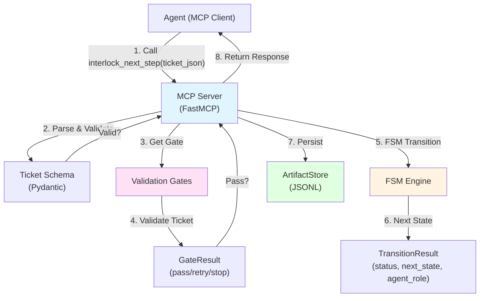
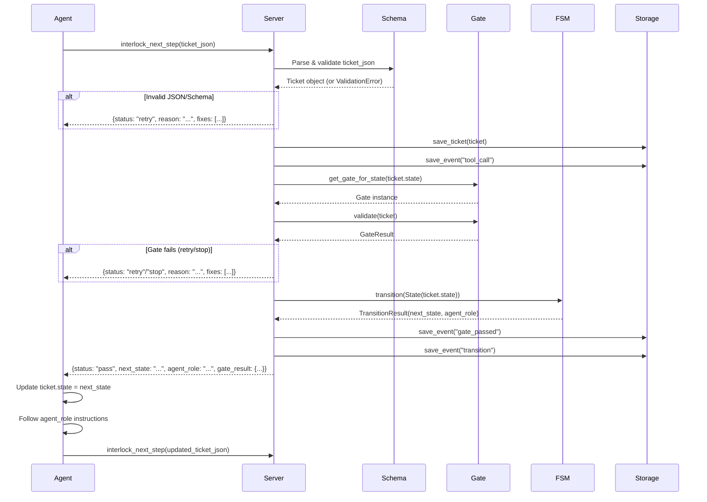

# Interlock PoC: Design, Components, and Flow

## High-Level Architecture

Interlock is an MCP server that governs an agent through a deterministic FSM. The agent proposes actions; Interlock enforces workflow rules, validates artifacts, and controls state transitions.



## Core Components

### 1. MCP Server (`interlock/server.py`)

Purpose: Exposes the `interlock_next_step` tool to agents.

- FastMCP server
- Single tool: `interlock_next_step(ticket_json: str)`
- Orchestrates validation, gates, and FSM transitions
- Returns governance response

Key responsibilities:
- Parse and validate `ticket_json`
- Route to appropriate gate
- Execute FSM transition
- Persist artifacts
- Return structured response

### 2. Ticket Schema (`interlock/schemas/ticket.py`)

Purpose: Strict Pydantic model for ticket data.

Fields:
- `ticket_id`: Unique identifier (non-empty)
- `title`: Ticket title (non-empty)
- `description`: Optional description
- `state`: Current FSM state (one of 7 valid states)
- `run_id`: Unique run identifier
- `created_at` / `updated_at`: Timestamps

Validation:
- Non-empty strings
- Valid FSM state enum
- Type checking via Pydantic

### 3. FSM Engine (`interlock/fsm.py`)

Purpose: Deterministic state machine controlling workflow progression.

7 States:
1. `INTAKE` → Parse ticket, extract basic info
2. `EXTRACT_REQUIREMENTS` → Extract AC, constraints, unknowns
3. `SCOPE_CONTEXT` → Determine what context to retrieve
4. `GATHER_EVIDENCE` → Collect snippets with source pointers
5. `PROPOSE_PLAN` → Generate plan tied to requirements
6. `ACT` → Execute plan, produce outputs
7. `FINALIZE` → Store artifacts, post summary (terminal)

Transition logic:
- Linear progression (no skipping)
- `transition(current_state)` returns `TransitionResult`
- Contains: `status`, `next_state`, `agent_role`, `reason`

Key principle: Agent cannot choose next state; FSM decides.

### 4. Validation Gates (`interlock/gates.py`)

Purpose: Fail-fast validation at each step.

Gate types:
- `IntakeGate`: Validates ticket intake (state="intake", required fields)
- `ExtractRequirementsGate`: Validates requirements extraction
- `GenericGate`: Fallback for states without specific gates

Gate result structure:
```python
GateResult(
    status: "pass" | "retry" | "stop",
    reasons: list[str],  # Why pass/fail
    fixes: list[str] | None  # How to fix (if retry)
)
```

Behavior:
- `pass`: Continue to next state
- `retry`: Fix issues and retry (bounded attempts)
- `stop`: Blocking failure, cannot proceed

### 5. Artifact Storage (`interlock/storage.py`)

Purpose: Persist tickets and events for traceability.

Storage format: JSONL (one JSON object per line)

Files:
- `tickets.jsonl`: All ticket snapshots (append-only)
- `events.jsonl`: All events (tool calls, gates, transitions)

Event types:
- `tool_call`: Agent called the tool
- `gate_passed`: Gate validation succeeded
- `transition`: State transition occurred

Benefits:
- Full audit trail
- Reproducibility
- Debugging support

## Complete Flow

### Step-by-Step Execution



### Example Flow

1. Agent creates ticket:
   ```json
   {
     "ticket_id": "DEMO-001",
     "title": "Add authentication",
     "state": "intake",
     "run_id": "run-123"
   }
   ```

2. Agent calls: `interlock_next_step(ticket_json)`

3. Server processes:
   - Validates ticket schema ✓
   - Runs `IntakeGate` ✓
   - FSM: `INTAKE` → `EXTRACT_REQUIREMENTS`
   - Persists ticket and events

4. Server responds:
   ```json
   {
     "status": "pass",
     "next_state": "extract_requirements",
     "agent_role": "Extract acceptance criteria, constraints, and unknowns from the ticket",
     "gate_result": {"status": "pass", "reasons": [...]}
   }
   ```

5. Agent updates ticket:
   - Sets `state = "extract_requirements"`
   - Performs work per `agent_role`
   - Calls `interlock_next_step` again with updated ticket

6. Process repeats until `FINALIZE` state

## Design Principles

### 1. Freedom vs Control

Agent decides:
- How to interpret the ticket
- What to look at next
- What plan makes sense
- What to produce

Interlock enforces:
- Allowed states and transitions
- Validation gates (fail-closed)
- Evidence requirements
- What gets persisted
- Fail-fast gateways

### 2. Deterministic FSM

- State transitions are explicit and enforced
- Agent cannot skip states
- Same ticket → same workflow path
- Reproducible runs

### 3. Fail-Fast Gates

- Validate early, fail early
- Clear error messages with fixes
- No silent failures
- Structured retry/stop responses

### 4. Evidence-First

- All artifacts are persisted
- Full audit trail
- Traceable to sources
- Inspectable by default

## Data Flow

```
Agent → MCP Tool Call → Server
                          ↓
                    Parse ticket_json
                          ↓
                    Validate (Pydantic)
                          ↓
                    Get Gate for State
                          ↓
                    Run Gate Validation
                          ↓
                    FSM Transition Logic
                          ↓
                    Persist Artifacts
                          ↓
                    Return Governance Response
                          ↓
Agent ← MCP Response ← Server
```

## Current PoC Scope

Implemented:
- ✅ MCP server with FastMCP
- ✅ Ticket schema with validation
- ✅ 7-state FSM with transitions
- ✅ State-specific gates for all 7 lifecycle states
- ✅ Structured artifacts (requirements, scope, evidence, plan, execution, finalization)
- ✅ Structured invalidation reports for retry/stop outcomes
- ✅ Artifact persistence (JSONL)
- ✅ End-to-end demo flow

Not yet implemented (future):
- External Jira/GitHub/Confluence tool integrations
- Bounded retry budgets and loop prevention policies
- Rich conflict detection across competing evidence

## Key Takeaways

1. Agent proposes, Interlock enforces
2. FSM controls progression; agent cannot skip states
3. Gates validate at each step (fail-fast)
4. Everything is persisted for traceability
5. Structured responses guide the agent

This design provides governance while allowing the agent flexibility within each state.
