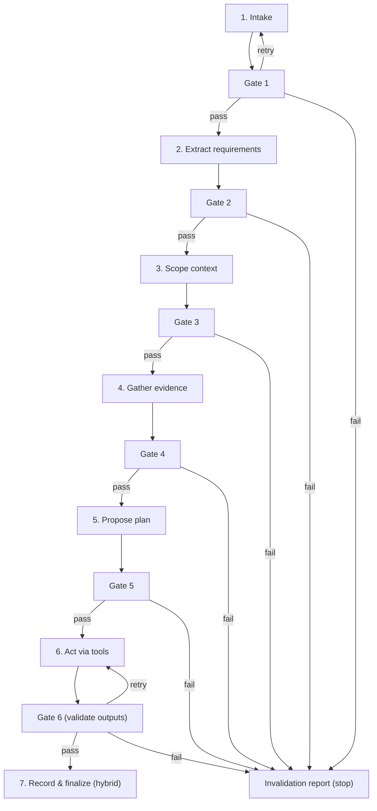
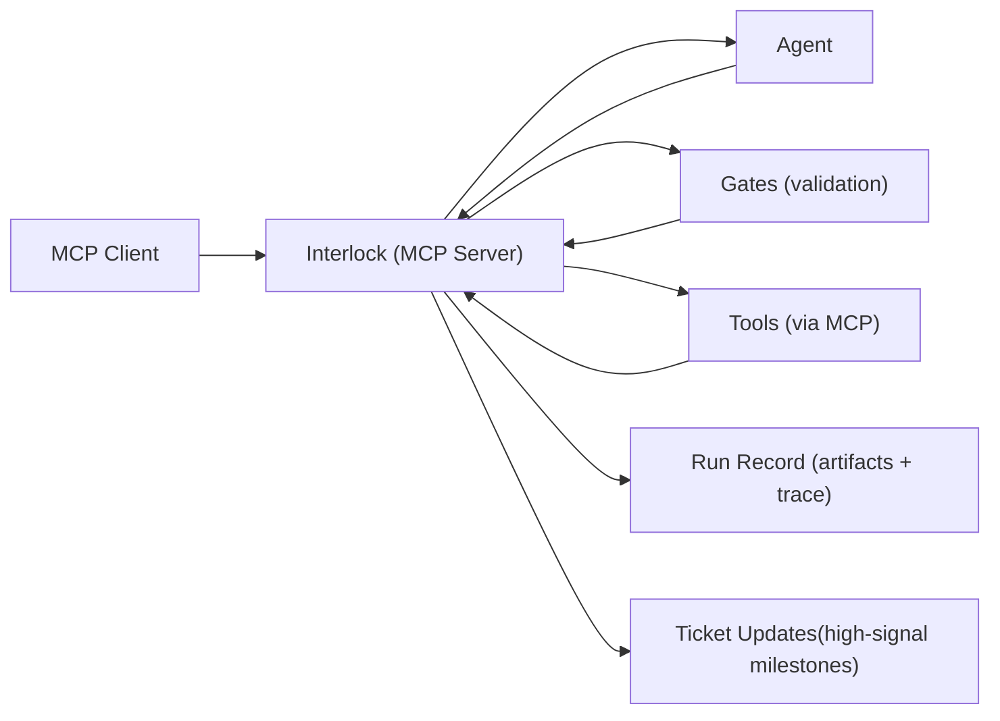

# Overview

> Interlock is an MCP server that resolves Jira tickets by compiling messy context into a validated, source-linked snapshot. Driven by a deterministic FSM, the agent collects evidence and produces structured artifacts, while enforces validation gates that govern progress.
> 

## Pain Points

---

- **Semantic context selection (vs structured ticket parsing)**
Ticket inputs are mostly untyped text, agents choose “what seems relevant” and fill gaps implicitly, ambiguity becomes assumptions, and those assumptions get reused downstream as facts.
- **No fail-fast checkpoints**
Without explicit gates, the agent can keep running even when the work is already invalid. Errors surface late (after more reasoning or edits), which makes recovery harder and wastes tokens and tool calls along the way.
- **State drift across steps**
Even if the ticket is understood early, the agent’s working state shifts as new context arrives, earlier constraints and decisions get diluted or overwritten - so later steps don’t reliably reflect earlier conclusions.
- **Non-deterministic workflow**
The same ticket can produce different tool choices, step ordering, and stopping points across runs, making outcomes hard to reproduce, compare, and debug.
- **Low visibility & observability**
Runs don’t naturally produce a clear audit trail of sources, assumptions, validations, and decisions, so review/debugging falls back to reading long chat logs.

## Core Ideas

---

- **Run the agent inside a controlled process**
Progress shouldn’t depend on whatever the model feels like doing next. The workflow defines the steps, what “good” looks like at each step, and when to stop.
- **Turn messy ticket input into a structured working set**
Don’t treat the ticket as a blob of text. Make explicit what needs to be done, what “done” means, what’s risky, and what’s still unknown, so important obligations don’t get buried.
- **Preserve a stable state across steps**
Requirements and decisions shouldn’t drift as more context arrives. Later steps should stay consistent with what was established earlier.
- **Use evidence and validation gates to fail fast**
Don’t let ambiguity silently turn into “facts.” When something can’t be supported or doesn’t check out, stop early instead of continuing and wasting tokens and tool calls on a bad path.
- **Keep context high-signal**
Avoid dumping everything into prompts. Keep the agent focused on the few pieces of information that actually matter, so runs are cheaper, faster, and less noisy.
- **Make runs inspectable by default**
Don’t ship a black-box result. Outputs should be traceable back to sources, with clear checkpoints and failure reasons so review and debugging are straightforward.
- **Checkpoint big changes**
While executing changes, the agent creates checkpoints at major boundaries, so you can review or roll back to a known-good state without restarting the run.

## **Core promise : freedom vs control**

---

**Agent decides**

- How to interpret the ticket (what it probably means, what to clarify)
- What to look at next (which files/docs to inspect)
- What plan makes sense (steps, ordering, tradeoffs)
- What to produce (a patch, a change proposal, a summary), but in a structured format so it’s inspectable

*In short: the agent is the “worker” that proposes actions and artifacts.*

**Interlock enforces**

This is where you need predictability and safety:

- Allowed states + transitions
The run follows a known lifecycle. You can’t jump randomly between phases or loop forever.
- Validation gates (fail closed)
Outputs must meet basic correctness/shape rules. If they don’t, the run doesn’t “kind of continue”—it stops.
- Evidence requirements + provenance
Important claims shouldn’t be free-floating. Interlock expects “show me where this came from” (or “this is an assumption”).
- What gets persisted and what counts as “done”
The system defines the official artifacts (requirements, evidence, plan, result, trace) and the completion criteria, so “done” isn’t whatever the model says.
- Fail-fast gateways
If something is missing/invalid, stop early with a clear invalidation report instead of continuing to spend tokens/tools on a run that’s already off-track.

*In short: Interlock is the “foreman” that controls the workflow, quality checks, and the audit trail.*

## **How it works (run lifecycle, 7 steps)**

---

1. **Intake ticket**
    
    **Purpose:** Establish the target and working environment.
    
    **Gate:** References resolve (ticket/repo/branch/links).
    
2. **Extract requirements (AC, constraints, unknowns)**
    
    **Purpose:** Make “done” and “missing” explicit.
    
    **Gate:** Requirements artifact is usable (unknowns captured, not implied).
    
3. **Scope context to retrieve**
    
    **Purpose:** Choose what to fetch based on requirements/unknowns.
    
    **Gate:** Retrieval targets are explicit and justified.
    
4. **Gather evidence with provenance**
    
    **Purpose:** Collect minimal supporting snippets with source pointers.
    
    **Gate:** Evidence items are traceable to their origin.
    
5. **Propose a structured plan**
    
    **Purpose:** Steps + intents tied to requirements/evidence.
    
    **Gate:** Plan is actionable; steps map to requirements or are marked “investigation”.
    
6. **Act via tools + produce candidate outputs**
    
    **Purpose:** Execute in controlled chunks with attributable tool results.
    
    **Checkpoint:** After significant changes, record a rollback point.
    
    **Gate:** Validate outputs vs requirements + grounding; on failure: 
    
    1. fixable → retry.
    2. blocking → invalidation report.
7. **Record and finalize (hybrid)**
    
    **Purpose:** Store canonical artifacts/trace; post milestone summary + outcome to Jira.
    

## Design Overview

---

Interlock runs as an **MCP server** that orchestrates Jira ticket resolution through a deterministic workflow. A client (or agent host) connects to Interlock via MCP and requests structured artifacts (requirements, evidence, plan, outputs). Interlock enforces validation gates and mediates external actions through tool calls (often delegating to downstream MCP servers like Atlassian/GitHub), while recording run artifacts/trace and posting high-signal milestones back to the Jira ticket.

## **Failure behavior (fail-closed / fail-fast)**

---

Interlock fails closed: if a gate can’t be satisfied, it **retries with a focused correction request** (when fixable) or **stops with an invalidation report** (when blocking).

- **Unresolvable inputs (ticket/repo/links)** → retry if fixable, else stop.
- **Requirements incomplete/contradictory** → stop or request missing AC/ constraints.
- **Evidence missing or not traceable** → stop, don’t proceed on implied facts.
- **Evidence conflict** → stop and surface the conflict.
- **Artifact invalid shape** → retry (bounded), then stop.
- **Tool failure/permissions** → retry transient, stop if blocked.
- **Gate failure (coverage/grounding/blockers)** → retry if fixable, else stop.
- **Looping/runaway** → stop on budget with reason.

**Invalidation report includes:** failed step/gate, reason, fixable vs blocking, and the minimum next input/ action.

## **Non-goals (product-level)**

---

- **Not full autonomy**
    
    Interlock doesn’t aim to “close tickets end-to-end without oversight.” It’s built for controlled progress and reviewable outcomes.
    
- **Not a Jira/Confluence replacement**
    
    It uses existing systems of record; it doesn’t replace ticketing, docs, or team workflow.
    
- **Not a generic chatbot**
    
    It’s optimized for ticket-resolution runs with structured artifacts, not open-ended conversation.
    
- **Not a magic context ingestion engine**
    
    It won’t make missing requirements or unavailable information disappear—unknowns are surfaced, not guessed away.
    
- **Not free-form tool execution**
    
    Interlock doesn’t allow unbounded tool use or side effects; actions are gated and must be attributable.
    
- **Not a substitute for engineering review**
    
    Code changes and decisions still require human review/approval (especially for risky changes).
    
- **Not “perfect correctness”**
    
    The goal is to reduce silent failure modes and make mistakes catchable early, not to guarantee zero errors.
    

## Use Case - **Resolve a Jira ticket end-to-end**

---

**Scenario:** An engineer assigns an agent a Jira ticket and wants a reliable, reviewable outcome.

1. **Start from the ticket**
    
    Interlock reads the Jira issue and produces a structured view of what the ticket actually requires (acceptance criteria, constraints, unknowns).
    
2. **Pull only relevant context**
    
    Based on those requirements, Interlock scopes what to fetch (specific repo areas, PRs, docs, prior tickets) and gathers evidence with source links.
    
3. **Generate a plan you can review**
    
    The agent proposes a step-by-step plan tied to the requirements and grounded in evidence.
    
4. **Execute in controlled chunks**
    
    The agent uses tools to inspect and modify the repo, leaving checkpoints after significant changes.
    
5. **Gate before progressing**
    
    Outputs are validated against requirements and grounding rules. If fixable, the agent retries with a focused correction; if blocking, Interlock stops with an invalidation report.
    
6. **Publish high-signal updates**
    
    Interlock stores the full run record and posts milestones back to the Jira ticket (requirements snapshot, plan, checkpoints, final outcome or invalidation).
    

**Result:** A ticket outcome that’s traceable back to sources, reproducible at the workflow level, and easy to review or roll back.