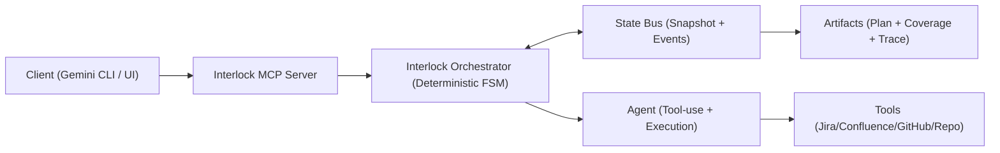
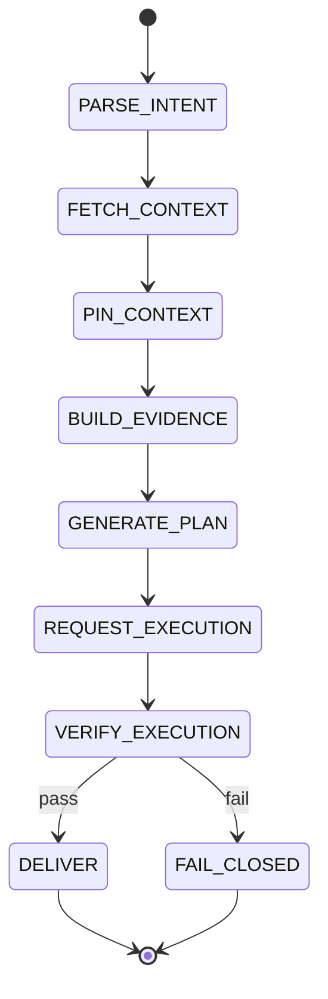

# Overview

Interlock turns Jira ticket resolution into an **agentic context compiler** controlled by a **deterministic FSM/graph** and powered by a **structured State Bus**.

Instead of pushing raw Jira/Confluence/GitHub dumps into a model, Interlock compiles the ticket into a **validated snapshot**: requirements are pinned, evidence is indexed, claims are grounded, and the final output is a plan that stays traceable back to sources.

**Interlock runs as an MCP server.**

The server executes a deterministic FSM/graph that **controls an agent**. The agent performs external tool calls (Jira/Confluence/GitHub/repo) and returns structured artifacts. Interlock validates them at gateways, persists a replayable run trace, and either advances, fails closed with an invalidation report, or resumes from the last checkpoint once fixed.

---

## **Pain Points**

### **1) The Context Tax**

Most AI workflows pass huge raw pages into prompts, increasing cost/latency and reducing accuracy.

**Interlock approach:** compile raw inputs into **evidence objects + typed entities**, so downstream reasoning uses only high-signal context.

### **2) Compounding Hallucinations**

Early mistakes (wrong file, wrong version, wrong assumptions) cascade.

**Interlock approach:** add **validation gates** and a grounding rule: actionable claims must cite evidence (or be explicit assumptions).

### **3) Non-Deterministic Behavior**

Agent tool selection varies run-to-run and can loop.

**Interlock approach:** deterministic routing via the FSM/graph. The model suggests structured outputs; it doesn’t choose tools.

### **4) Memory Drift**

Requirements get diluted as more context is gathered.

**Interlock approach:** requirements are **pinned** early and every later step is checked for coverage.

---

## **Core Ideas**

### **1) Evidence-first reasoning**

Interlock’s unit of context is an **evidence object** (snippet + provenance + locator), not full documents.

This keeps prompts small, traceable, and cheaper.

### **2) Pinned requirements**

Acceptance criteria and constraints become an **immutable “source of truth”** for the run.

Everything else (evidence, entities, plan) must align to it.

### **3) Structured outputs + validation**

Key artifacts (requirements, entities, plan, coverage) are generated as **schema-validated objects**.

This turns “almost correct” LLM output into deterministic validation errors.

### **4) Replayable State Bus**

Interlock uses a **structured State Bus** that supports audit/debug:

- append-only event history (what happened)
- materialized snapshot (current state)

  This makes runs explainable and stable.


### **5) Gateways + Resume**

Interlock advances only when validations pass. On invalidation it fails closed with a clear report and stores next_state so the run can resume after the issue is fixed—without redoing earlier steps.

---

## **Design Overview**

Interlock splits responsibilities into 3 layers:

- **MCP Server (Interface):** exposes tools to run flows and fetch artifacts
- **Control Plane (Interlock):** deterministic FSM/graph + gateways + resume
- **Worker (Agent + Tools):** performs tool calls and execution, returns structured results

The model is used to extract structured artifacts (requirements, entities, plan), but **routing is deterministic**.



---

## FSM Diagram



---

## Snapshot Schema

```json
"run": {
  "run_id": "...",
  "ticket_id": "...",
  "status": "RUNNING|FAIL_CLOSED|DELIVERED",
  "next_state": "REQUEST_EXECUTION",
  "created_at": "..."
},
"pinned": {
  "problem_statement": "...",
  "acceptance_criteria": ["..."],
  "todos": ["..."],
  "constraints": ["..."]
},
"working": {
  ...
  "execution": {
    "request": { "instructions": "...", "must_run_tests": true },
    "result": { "success": true, "tests_ran": ["pytest -q"], "test_output_summary": "..." }
  }
}
```

---

## **MCP Tools**

Interlock exposes tools like:

- interlock.run
- interlock.get_snapshot
- interlock.get_events
- interlock.get_summary
- interlock.list_runs

---

## **Tech Stack (High Level)**

- **Python** runtime
- **LangGraph-style orchestration** (graph/FSM with checkpointing + interrupts)
- **Pydantic schemas** (and PydanticAI-style patterns) for structured outputs and validation
- **Interlock runs as an MCP server** exposing tools for ticket resolution and artifact retrieval
- **Connectors** for Jira/Confluence/GitHub/repo can be implemented as MCP tools or direct adapters
- Storage: start with **JSONL events + JSON snapshot**, optional upgrade to **SQLite/Postgres**

---

## **User Stories**

### **Engineer (IC)**

- “Given a Jira ticket, I want a **grounded plan** that references evidence, so I can execute quickly without second-guessing.”
- “If the ticket is ambiguous, I want Interlock to **list unknowns** and stop deterministically instead of guessing.”

### **Tech Lead**

- “I want outputs that are **consistent run-to-run** so I can trust the system in team workflows.”
- “I want a **coverage report** mapping acceptance criteria to plan steps and validation, so I can review faster.”

### **Engineering Manager**

- “I want lower cycle time on tickets by turning messy context into a **clear, auditable execution plan**.”
- “I want visibility into failures (permissions, missing docs, unclear requirements) with **actionable reasons**.”

### **Platform / DevOps**

- “I want traceability (what sources were used, what tool calls ran) so I can **debug and govern** agent behavior.”
- “I want budget controls (tokens, search rounds, retries) to keep the system **cost-predictable**.”

---

## **What Interlock Produces**

A successful run yields:

- Pinned requirements (acceptance criteria + constraints)
- Evidence index with provenance
- Typed extracted entities
- Grounded plan (steps cite evidence or assumptions)
- Coverage report
- Run trace (events + snapshot)
- Execution result (tests run + output summary)
- Invalidation report (when failing closed)